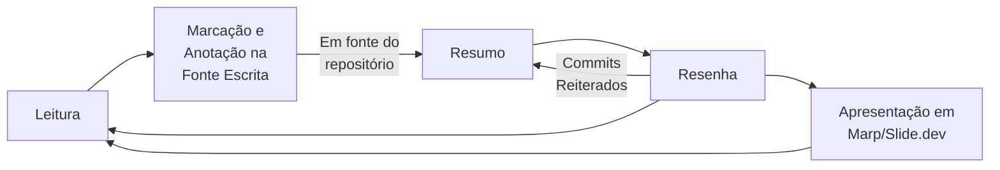
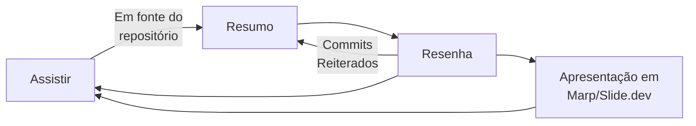
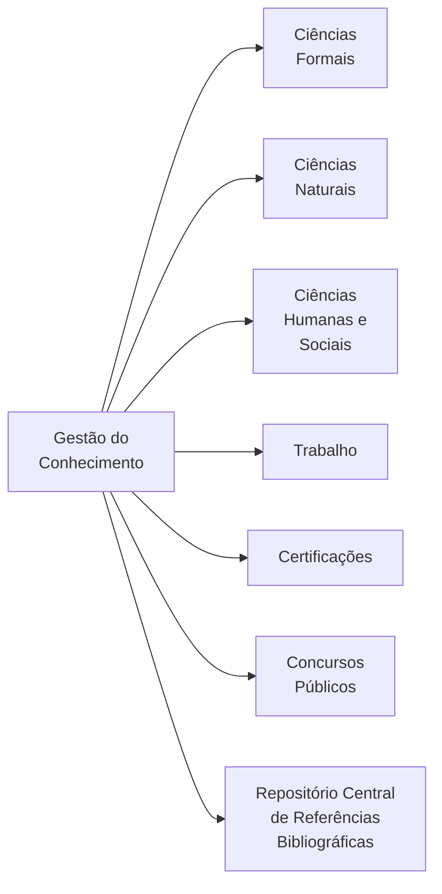
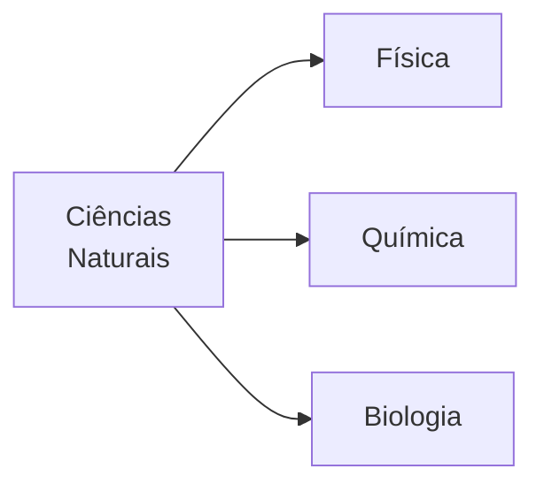
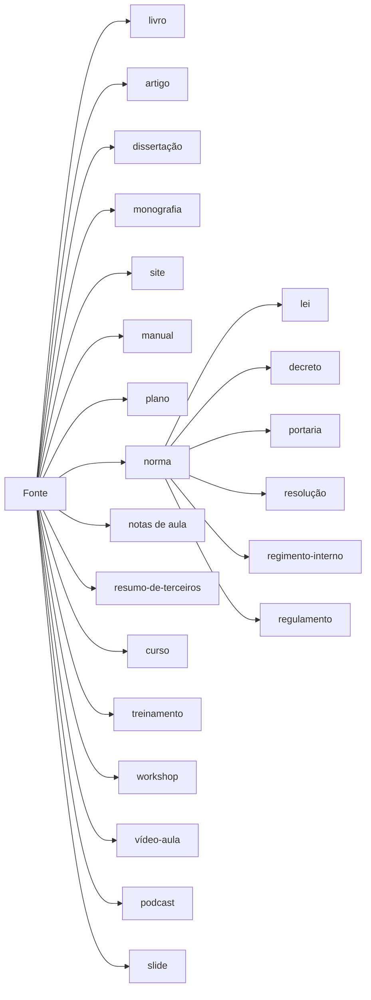

# Gestão de Conhecimento

Este documento estabelece diretrizes para minha gestão do conhecimento com vistas ao meu desenvolvimento pessoal e profissional.

|Contribuição|Data|Versão|Observações &#47; Notas |
|:---:|:---:|:---:|:---|
|Daniel Claudino|15/06/2023|v0.0.1|Versão Inicial do documento|

## Sobre

<table align="center" border="0">
<tr>
  <td align="center">
      
    <b>Daniel Claudino</b></td>
  <td align="center"><a href="https://github.com/dnlclaudino/curriculum-vitae">Portfólio   Curriculum Vitae</a></td>
</tr>
</table>
  
## Necessidades

|#|Necessidade|
|:---:|:---|
|1|Tornar meu conhecimento explicitamente registrado|
|2|Otimizar a recuperação do meu conhecimento|
|3|Organizar meus conhecimentos pessoais e profissionais mais relevantes|
|4|Demonstrar minhas habilidades de gestão do conhecimento e gestão de minhas competências|
|5|Demonstrar atitudes que geram valores organizacionais, profissionais e sociais|
|6|Identificar e explicitar as competências organizacionais, individuais e gerenciais adquiridas com minha gestão do conhecimento|
|7|Contribuir no desenvolvimento de pessoas e organizações|

## Objetivos

|# Objetivo |Relacionado a Necessidade # | Descrição do Objetivo|
|:---:|:---|:---|
|1|#1, #2 e #3|Criar repositórios para cada tema, assunto, disciplina, tecnologia, metodologia, método ou boa prática cujo conhecimento será organizado e gerenciado|
|2|#6|Desenvolver texto apresenta a relação entre a gestão do conhecimento e a gestão de competências adquiridas|
|3|#1,#2,#3,#5 e #7|Desenvolver apresentações (Marp/Slide.dev/PPTXs) do material produzido|

## Trilha de Aprendizagem

### Quando a Fonte é ESCRITA

### Quando a Fonte NÃO É ESCRITA

## Gestão de Competências

Toda a minha gestão do conhecimento comunica-se com minha gestão de competências. Minha gestão de competências é orientada por linhas gerais direcionadoras (= política) representadas por declarações escritas a respeito das minhas intenções em relação aos meus conhecimentos, habilidades e atitudes, proporcionando linhas mestras para se atingir os meus objetivos pessoais, profisionais e da organizacção em que atuo, orientando decisões e a formulação de objetivos e elaboração de outras orientações relacionadas à própria gestão do conhecimento e à própria gestão de competências.

Para mais detalhes acesse minha política de gestão de competências no repositório "[Gestão de Competências](https://github.com/dnlclaudino/gestao-de-competencias/tree/master)".

## Áreas para Minha Gestão do Conhecimento

Todo os conhecimentos que foram considerados relevantes para minha gestão do conhecimento e minha gestão de competências pessoal, profissional e organizacional em que atuo são relacionados abaixo. Pretende-se realizar um trabalho contínuo de revisão e aperfeiçoamento para que ela seja categorizada cada vez mais de forma técnica.

<table>
  <tr>
    <td align="center">
        
       <b>Atenção</b>
    </td>
    <td valign="top">
      Sempre que adicionar novas <b>Áreas do conhecimento</b>, atualizar o 
      <a href="https://github.com/dnlclaudino/repositorio-central-referencias-bibliograficas/tree/master">Repositório Central de Referências Bibliográficas</a>
    </td>
  </tr>
</table>

A ciência engloba um vasto conjunto de conhecimentos organizados, que se distribuem em três ramos principais[^CONCEITOS-DO-MUNDO-2023].

Para viabilizar e facilitar a gestão do conhecimento, todo o material será produzido, alocado e mantido seguinto a seguinte esquematização:

### Ciências Formais

Ao contrário das ciências naturais, as formais não se dedicam ao estudo da natureza, mas de objetos e sistemas puramente abstratos, mas que podem ser aplicados ao mundo real. Assim, seus objetos de estudo existem apenas no mundo da mente, e sua validade não deriva de experimentos, mas de axiomas, raciocínios e inferências. Exemplos deste tipo de ciência são: matemática , lógica , ciência da computação , etc.

|Ramo do Conhecimento|Sub-ramo do Conhecimento|Repositório de Conhecimento|Descrição|Link|
|:---|:---|:---|:---|:---|
|CIÊNCIAS FORMAIS|[Ciência da Computação](./ciencia-da-computacao.md)|- ( ... )|-|-|
|CIÊNCIAS FORMAIS|Matemática|Estatística|-|-|
|CIÊNCIAS FORMAIS|Matemática|Cálculo|-|-|
|CIÊNCIAS FORMAIS|Matemática|Cálculo Vetorial|-|-|
|CIÊNCIAS FORMAIS|Matemática|Ensino Fundamental|-|-|
|CIÊNCIAS FORMAIS|Matemática|Ensino Médio|-|-|
|CIÊNCIAS FORMAIS|Matemática|Geometria Analítica|-|-|
|CIÊNCIAS FORMAIS|Matemática|Reciocínio Lógico e Matemático|-|-|
|CIÊNCIAS FORMAIS|Matemática|Trigonometria|-|-|

### Ciências Naturais

Este é o nome dado a todas as disciplinas científicas que se dedicam ao estudo da natureza, utilizando o método científico para reproduzir experimentalmente (isto é, sob condições controladas) os fenômenos que lhes interessam. Também são conhecidas como ciências experimentais, ciências exatas ou ciências físico-naturais e são exemplos disso: biologia , física , química , astronomia , geologia , etc.

|Ramo do Conhecimento|Sub-ramo do Conhecimento|Repositório de Conhecimento|Descrição|Link|
|:---|:---|:---|:---|:---|
|CIÊNCIAS NATURAIS|Física (Ensino Médio)|Fisica 1|-|-|
|CIÊNCIAS NATURAIS|Física (Ensino Médio)|Fisica 2|-|-|
|CIÊNCIAS NATURAIS|Física (Ensino Médio)|Fisica 3|-|-|
|CIÊNCIAS NATURAIS|Química (Ensino Médio)|[Química 1](https://github.com/dnlclaudino/quimica-1)|-|-|
|CIÊNCIAS NATURAIS|Química (Ensino Médio)|[Química 2](https://github.com/dnlclaudino/quimica-2)|-|-|
|CIÊNCIAS NATURAIS|Química (Ensino Médio)|[Química 3](https://github.com/dnlclaudino/quimica-3)|-|-|
|CIÊNCIAS NATURAIS|Biologia (Ensino Médio)|[Biologia 1](https://github.com/dnlclaudino/biologia-1)|-|-|
|CIÊNCIAS NATURAIS|Biologia (Ensino Médio)|[Biologia 2](https://github.com/dnlclaudino/biologia-2)|-|-|
|CIÊNCIAS NATURAIS|Biologia (Ensino Médio)|[Biologia 3](https://github.com/dnlclaudino/biologia-3)|-|-|

### Ciências Humanas e Sociais

Também conhecido como ciências humanas, este conjunto de disciplinas se dedica ao estudo da humanidade, mas preservando uma perspectiva empírica, crítica, orientada pelo método científico. Está, bem, afastado das humanidades e do mundo da subjetividade, mas também do mundo experimental, recorrendo antes à estatística, à transdisciplinaridade e à análise do discurso . Exemplos deste tipo de ciência são: sociologia , antropologia , ciência política , economia , geografia , etc.

|Ramo do Conhecimento|Sub-ramo do Conhecimento|Repositório de Conhecimento|Descrição|Link|
|:---|:---|:---|:---|:---|
|CIÊNCIAS HUMANAS E SOCIAIS|Administração|Auditoria|-|-|
|CIÊNCIAS HUMANAS E SOCIAIS|Administração|Gestão de Projetos|-|-|
|CIÊNCIAS HUMANAS E SOCIAIS|Administração|Gestão de Processos de Trabalho|-|-|
|CIÊNCIAS HUMANAS E SOCIAIS|Administração|Governança de TI|-|-|
|CIÊNCIAS HUMANAS E SOCIAIS|Administração|[Gestão de Serviços de TI](https://github.com/dnlclaudino/gerenciamento-de-servicos-de-ti)|-|-|
|CIÊNCIAS HUMANAS E SOCIAIS|Administração|Logística|-|-|
|CIÊNCIAS HUMANAS E SOCIAIS|Ciência Política|Introdução à Ciência Política|-|-|
|CIÊNCIAS HUMANAS E SOCIAIS|Contabilidade|Administração Financeira e Orçamentária|-|-|
|CIÊNCIAS HUMANAS E SOCIAIS|Contabilidade|Introdução à Contabilidade|-|-|
|CIÊNCIAS HUMANAS E SOCIAIS|Direito|Ciência Política|-|-|
|CIÊNCIAS HUMANAS E SOCIAIS|Direito|Direito Constitucional|-|-|
|CIÊNCIAS HUMANAS E SOCIAIS|Direito|[Direito Administrativo](https://github.com/dnlclaudino/direito-administrativo)|-|-|
|CIÊNCIAS HUMANAS E SOCIAIS|Direito|Normas Jurídicas|-|-|
|CIÊNCIAS HUMANAS E SOCIAIS|Direito|Normas Relacionadas com Computação LGPD - Lei geral de  Proteção de Dados|-|-|
|CIÊNCIAS HUMANAS E SOCIAIS|Direito|Licitações e Contratos|-|-|
|CIÊNCIAS HUMANAS E SOCIAIS|Economia|Economia|-|-|
|CIÊNCIAS HUMANAS E SOCIAIS|Filosofia|[Filosofia](https://github.com/dnlclaudino/filosofia)|-|-|
|CIÊNCIAS HUMANAS E SOCIAIS|Geografia|Geografia Geral|-|-|
|CIÊNCIAS HUMANAS E SOCIAIS|Geografia|Geografia do Brasil|-|-|
|CIÊNCIAS HUMANAS E SOCIAIS|História|História Geral|-|-|
|CIÊNCIAS HUMANAS E SOCIAIS|História|História do Brasil|-|-|
|CIÊNCIAS HUMANAS E SOCIAIS|Linguística|[Português &#124; Redação &#124; Inglês](https://github.com/dnlclaudino/linguistica/tree/master)|-|-|
|CIÊNCIAS HUMANAS E SOCIAIS|Linguística|Literatura|-|-|
|CIÊNCIAS HUMANAS E SOCIAIS|Medicina|Anatomia|-|-|
|CIÊNCIAS HUMANAS E SOCIAIS|Medicina|Fisiologia|-|-|
|CIÊNCIAS HUMANAS E SOCIAIS|Metodologia Científica|Metodologia Ciêntífica e da Pesquisa|-|-|
|CIÊNCIAS HUMANAS E SOCIAIS|Padronizações|[Normas Nacionais e Internacionais ISOs/NBRs/RFCs](https://github.com/dnlclaudino/normas-de-padronizacao-nacional-internacional)|-|-|
|CIÊNCIAS HUMANAS E SOCIAIS|Psicologia|[Psicologia](https://github.com/dnlclaudino/psicologia)|-|-|
|CIÊNCIAS HUMANAS E SOCIAIS|Sociologia|[Sociologia](https://github.com/dnlclaudino/sociologia)|-|-|

### Trabalho

|#|Área|Subárea (Repositórios)|Anotações / Observações|
|:---|:---|:---|:---|
|1|Atribuições Extraregulamentares da SEINF|Governança e  Gestão da Estratégia|-|
|2|Atribuições Extraregulamentares da SEINF|Gestão do Patrimônio|-|
|3|Atribuições Extraregulamentares da SEINF|Gestão do Orçamento|-|
|4|Atribuições Extraregulamentares da SEINF|Gestão de Aquisições|-|
|5|Atribuições Extraregulamentares da SEINF|Gestão de Contratos e ARPs|-|
|6|Atribuições Extraregulamentares da SEINF|Gestão de Riscos|-|
|7|Atribuições Extraregulamentares da SEINF|Gestão do Orçamento|-|
|8|Atribuições Regulamentares da SEINF|Gestão de Segurança da Informação|-|
|9|Atribuições Regulamentares da SEINF|Gestão da Implantação  de Novo Sistema, Solunção ou Serviço|-|
|10|Atribuições Regulamentares da SEINF|Eleições Suplementares|-|
|11|Atribuições Regulamentares da SEINF|Eleições|-|

### Concursos Públicos e Certificações

|Ano|Concurso|Cargo|Tema|Conhecimento|Descrição|Link|
|:---|:---|:---|:---|:---|:---|:---|
|2025|TRIBUNAL REGIONAL ELEITORAL-PB|Analista Judiciário: Analista de Suporte|Conhecimentos Básicos:  Conhecimentos Específicos:|&nbsp;&nbsp;- Português &nbsp;&nbsp;- Noções de Direito Constitucional &nbsp;&nbsp;- Noções de Direito Eleitoral &nbsp;&nbsp;- Noções de Direito Administrativo &nbsp;&nbsp;- Normas Aplicáveis aos Servidores Públicos Federais &nbsp;&nbsp;- Inglês Técnico  Fundamentos da Computação &nbsp;&nbsp;-Engenharia de Software &nbsp;&nbsp;-Gerência de Projetos de Software &nbsp;&nbsp;-Redes de Computadores &nbsp;&nbsp;-Banco de Dados &nbsp;&nbsp;-Linguagens de Programação / Formatação|

## Ícones Utilizados

Serão utilizados os ícones do [repositório público imagens](https://github.com/dnlclaudino/imagens) em todo o material produzido nesta **gestão do conhecimento**:

Segue abaixo modelo para utilização ods ícones lembrando que **o texto que acompanha os ícones** deve manter relação com o **tipo de ícone** utilizado.

<table>
  <tr>
    <td align="center">
        
       <b>Não Cometa Erros</b>
    </td>
    <td valign="top">
      Não confunda <b>atos administrativos</b> com <b>atos da administração</b>, para mais informações veja "<a href="#atos-privados-praticados-pela-administração">Atos Privados Praticados Pela Administração</a>"
    </td>
  </tr>
</table>

## Recursos Adicionais

São recursos adicionais utilizados nos resumos

|**Recurso**|**Descrição**|
|:---:|:---|
| **Geogebra**|Ferramenta matemática para geometria e algebra|
| **Draw.io**|Fluxogramas e esquemas|
| **BPMN.io**|Mapeamento de processos usando notação BPMN|
| **Sli.dev**|Existem inúmeras ferramentas para criar slides cheias de recurso, de uso geral, como Microsoft PowerPoint e Apple Keynote. Elas funcionam muito bem para fazer slides legais com animações, gráficos, e muitas outras coisas, além de serem bem intuitivas e fáceis de aprender. Então por que gastar tempo fazendo o Slidev? O Slidev visa fornecer a flexibilidade e a interatividade para desenvolvedores fazerem suas apresentações ainda mais interessantes, expressivas, e atraentes usando ferramentas e tecnologias das quais já estão familiarizados.|
| **MARP.app**|Outra ferramenta de elaboração de slides que permite versionamento e a separação entre a camada de conteúdo e a camada de apresentação|
| **Power Point**|Apresentações elaboradas com o software **Power Point** da Microsoft|
| **Mesa Digitalizadora** **One by Wacom**|Desenhos e anotações em formato PNG construídas à mão livre, feitas com a mesa digitalizadora da Wacom.|

## A Hierarquia dos Repositórios

1. O primeiro nível do repositório corresponderá a um tema, assunto, disciplina, tecnologia, metodologia, método ou boa prática;
    - No primeiro nível será criado o arquivo “README.md” contendo um documento markdown de sumário contendo manifesto (o que o repositório contém), uma tabela com as versões com descrições (TAGS) e outra tabela com as relações de partes do do resumo com seus respectivos links ;
2. O segundo nível na hierarquia do repositório será a FONTE do material a ser resumido (livro, artigo, dissertação, monografia, site, manual,plano, norma [lei, decreto,portaria, resolução, regimento-interno, regulamento] , notas-de-aula, resumo-de-terceiros, curso, workshop, vídeo-aula, podcast, slide, etc)

3. Outras Orientações:
    - Cada pasta FONTE conterá um arquivo README.md contendo sumário com (o que o FONTE contém) e uma tabela com as relações de partes do do resumo com - seus respectivos links;
    - Cada pasta FONTE conterá pastas para os RECURSOS agregados aos resumos e conhecimento registrados:
    - Uma pasta chamada “figuras” para armazenar imagens a serem utilizadas no terceiro nível;
    - Uma pasta chamada “planilhas” para armazenar planilhas eletrônicas
    - Uma pasta chamada "código-fonte" para armazenar códigos-fonte;
    - Obs: podem haver outras pastas para armazenar outros RECURSOS, devendo ser seguido as regras de nomenclatura de PASTAS explicitadas mais adiante;

4. O terceiro nível na hierarquia do repositório conterá pastas para cada capítulo, unidade, artigo, documento, etc a ser resumido em um arquivo markdown (*.MD)

## Fluxo de trabalho para elaboração de resumos

Deve-se usar o Github e a conta “dnlclaudino@gmail.com” para criar e manter resumos.

1. Deve-se identificar o tema, assunto, disciplina, tecnologia, metodologia, método, boa prática a ser resumida (veja lista em XXXXXX na forma de mapa mental);
2. Verificar se já existe um repositório (Github) para o resumo
    - Caso não exista, criar um repositório no Github;
    - Mantenha o padrão da gestão do conhecimento, incluindo seção "**Versão da Política de Gestão do Conhecimento**" e texto-padrão: "A versão da [Política de Gestão do Conhecimento](https://github.com/dnlclaudino/gestao-do-conhecimento/tree/master) utilizada é v0.0.1. As [regras para realização de commits](https://github.com/dnlclaudino/gestao-do-conhecimento/blob/master/README.md#regras-para-nomenclatura-de-commits-no-github) estão disponíveis em Regras para commits no Github.";
    - Incluir seção "**Relação das Compatências Desenvolvidas**", seguindo as orientações contidas na minha Gestão por Competências, na seção [Descrição das Competências](https://github.com/dnlclaudino/gestao-de-competencias/blob/master/README.md#descri%C3%A7%C3%A3o-das-compet%C3%AAncias);
    - Incluir seção "**Licença**" seguindo as orientações abaixo:
      - O texto-padrão: "Este material está sob licença [Creative Commons CC BY-NC-SA 4.0](https://creativecommons.org/licenses/by-nc-sa/4.0/deed.pt_BR): esta licença permite que outros remixem, adaptem e criem a partir do seu trabalho para fins não comerciais, **desde que atribuam o devido crédito ao autor (Daniel Claudino)** e que licenciem as novas criações sob termos idênticos."
      - Você tem os seguintes direitos:
        - Compartilhar: copiar e redistribuir o material em qualquer suporte ou formato
        - Adaptar: remixar, transformar, e criar a partir do material
      - De acordo com os seguintes termos:
        - Atribuição — Você deve dar o crédito apropriado, prover um link para a licença e indicar se mudanças foram feitas. Você deve fazê-lo em qualquer circunstância razoável, mas de nenhuma maneira que sugira que o licenciante apoia você ou o seu uso.
        - Não Comercial — Você não pode usar o material para fins comerciais.
        - Compartilha Igual — Se você remixar, transformar, ou criar a partir do material, tem de distribuir as suas contribuições sob a mesma licença que o original.
      - Normalmente, sigo a licença [Creative Commons CC BY-NC-SA 4.0](https://creativecommons.org/licenses/by-nc-sa/4.0/deed.pt_BR)
      - Incluir o HTML abaixo em cada FONTE e no REPOSITÓRIO:
<table width="350px">
<tr>

<td align="center">
  
 A <b>Gestão do Conhecimento</b> de <a xmlns:cc="http://creativecommons.org/ns#" href="https://github.com/dnlclaudino/gestao-do-conhecimento" property="cc:attributionName" rel="cc:attributionURL">Daniel Claudino</a> está licenciado com uma Licença <a rel="license" href="http://creativecommons.org/licenses/by-nc/4.0/">Creative Commons - Atribuição-NãoComercial 4.0 Internacional</a>.

</td>
  
</tr>
</table>
  
3. Verificar se já existe a FONTE no repositório (Github) para o resumo
    - Caso não exista, criar a FONTE dentro do repositório;
4. Organizar o repositório em pastas para cada capítulo, unidade, artigo, documento, etc a ser resumido em um arquivo markdown próprio;
5. O repositório do github deve conter
    - Um Branch chamada master para a versão final dos documentos (arquivos)
    - Deve ser criada uma branch chamada desenvolvimento-’nome-da-fonte’-’nome-do-capitulo/unid.parte’ para adição, alteração, remoção de texto do resumo
    - Não modificar diretamente a branch master !
6. Após a revisão do texto elaborado na branch desenvolvimento-’nome-da-fonte’-’nome-do-capitulo/unid.parte’’ , deve ser feito um merge com a branch master;
7. Após a conclusão do resumo de uma capítulo, unidade, parte do documento, etc:
    - Deve ser criado uma TAG no repositório com o número da versão e descrição do que foi resumido;
      - Obs: Seguir regras de versionamento semântico deste documento para denominação das TAGS
    - O arquivo “README.md” deve ser atualizado;

## Regras para versionamento semântico nos documentos

1. Usar o seguinte versionamento semântico:

    - MAJOR.MINOR.PATCH
    - PATCH -> Aumentar sempre que partes de um documento (arquivo) de resumo forem sendo entregues;
    - MINOR -> Sempre que um (arquivo) documento foi finalizado (capítulo, unidade, artigo, documento, etc)
    - MAJOR* -> Sempre que um mesmo tópico for resumido a partir de outra fonte

* Se após eu fizer um resumo de um manual do TCU sobre gestão de riscos (uma versão MAJOR), eu fizer um outro resumo sobre o mesmo tema (gestão de riscos) de um manual de gestão de riscos do CNJ (outra versão MAJOR acrescentada).

## Regras para nomenclatura de fontes

1. Todas as letras em minúscula;
2. As palavras não devem conter acentos diacríticos (agudo, circunflexo,crase,etc);
3. Palavras separadas por hífen “-”;
4. Para nomenclatura de FONTES
    - Elementos:
      - Tipo da fonte: livro, livro-treinamento,apostila-treinamento,slide-treinamento,livro-curso,apostila-curso,slide-curso, artigo, dissertação, monografia, site, manual,plano, norma [lei, decreto,portaria, resolução, regimento-interno, regulamento], notas-de-aula, resumo-de-terceiros, curso, treinamento, workshop, vídeo-aula, podcast, slide, etc (sem acentos diacríticos);
      - Sobrenome dos autores (pessoa física, ou pessoa jurídica quando institucional) em MAIÚSCULA separados por hífen “-”
      - Ano com quatro dígitos;
      - Uma descrição com o título da fonte (separadas por hífen e sem sinais diacríticos). Encurtar, se necessário.

5. Exemplos:
      - Livros
        - livro-SAYER-WILLIANS-2015-lean-para-leigos
        - livro-SIQUEIRA-2014-certificacao-lpi-1
        - livro-GUEDES-2018-uml-2-uma-abordagem-pratica
      - Cursos
        - curso-ENAP-2023-gerenciamento-de-servicos-de-ti 
        - curso-CNJ-2023-analise-de-dados-com-r
        - curso-CNJ-2023-analise-de-dados-com-excel
      - Normas
        - portaria-TRE-PB-14-2019-regulamento-interno-da-secretaria 
        - resolucao-CNJ-324-2020-diretrizes-para-gestao-documental-e-da-memoria-no-poder-judiciario
      - Manuais
        - manual-CNJ-2020-manual-de-gestao-documental
        - manual-CNJ-2020-manual-de-digitalizacao-de-documentos
        - manual-TSE-2021-manual-de-gestao-documental
        - manual-TSE-2021-manual-de-digitalizacao-de-documentos

## Regras para nomenclatura de pastas e documentos de resumo

1. Todas as letras em minúscula;
2. As palavras não devem conter acentos diacríticos (agudo, circunflexo, cedilha, crase,etc);
3. Palavras separadas por hífen “-”;
4. Para nomenclatura de PASTAS
      - Escolha uma nomenclatura que reflita de forma suficientemente genérica o tema / assunto / disciplina / tecnologia / metodologia / método / boa prática
5. Para nomenclatura de ARQUIVOS
    - Caso o objeto do resumo seja dividido em CAPÍTULOS
      - Elementos:
        - A expressão “capitulo”
        - O número do capítulo/parte com dois dígitos;
        - Uma descrição breve do capítulo;
      - Exemplo.:
         - capitulo-02-conhecendo-o-gerenciamento-de-Servicos.MD
      - Caso o objeto do resumo seja dividido em <ESPECIFICAR A FORMA DE DIVISÃO>

## Regras para nomenclatura de imagens

1. Todas as letras em minúscula;
2. As palavras não devem conter acentos diacríticos (agudo, circunflexo,crase,etc);
3. Palavras separadas por hífen “-”;
4. Para nomenclatura de ARQUIVOS DE IMAGENS
    - Caso o objeto do resumo seja dividido em CAPÍTULOS
      - Elementos:
         - A expressão ‘figura’
         - O número do capítulo/parte com dois dígitos;
          - Uma descrição breve da figura;
      - Exemplo.:
      - figura-02-classificacao-das-tipologias-de-servicos.PNG
    - Caso o objeto do resumo seja dividido em < ESPECIFICAR A FORMA DE DIVISÃO >

## Regras para nomenclatura de tabelas e quadros

1. Para nomenclatura de TABELAS e QUADROS
    - Caso o objeto do resumo seja dividido em CAPÍTULOS
      - Elementos:
        - A expressão ‘Tabela’;
        - Um hífen “-”;
        - Uma descrição breve da tabela com todos os sinais diacríticos pertinentes;
    - Exemplo.:
      - Tabela - Classificação das tipologias de serviços

## Regras para commits no Github

### Orientações gerais

- Os **commits** devem ter entre 50 a 60 caracteres
- A mensagem de commit deve começar com um **prefixo** seguindo de dois pontos;
- O prefixo deve expressar a **razão (o porquê) de realizar o commit**
- Commits com mais de uma razão diferente deve ser dividido em tantos commits quanta razões diferentes existirem
- Commits devem deixar claro a parte que está sendo construída, revisada ou removida do produto final

### Razões para os commits (com PREFIXOS)

1. Primeiro commit de uma tema (repositório):
  - **Orientações**:
    - Orientação 1
    - Orientação 2
  - **Prefixo**: "CRIAÇÃO REPOSITÓRIO: "
  - **Mensagem de Commit**: Versão Inicial (V0.0.1)
  - **Descrição da Mensagem**:
    - Linha 1 (...)
    - Linha 2 (...)
2. Primeiro commit de uma **FONTE**:
  - **Orientações**:
    - Orientação 1
    - Orientação 2  
  - **Prefixo**: "CRIAÇÃO FONTE: "
  - **Mensagem de Commit**: Versão Inicial (V0.0.1)
  - **Descrição da Mensagem**:
    - Linha 1 (...)
    - Linha 2 (...)
3. Para conclusão de **RESUMO** de itens do documento:
  - **Prefixo**: "RESUMO:"
  - **Mensagem de Commit**: Concluir resumo unid. **01** / cap. **01** / item **2.1**
  - **Descrição da Mensagem**:
    - Finalizado o resumo do item 2 (O Sistema De Comunicação) da unid. 01 / cap. 01;
    - 3/11 itens concluídos;
    - Atualizar progresso para ~18,2%;
4. Para conclusão de **RESUMO(S)** de itens do documentos e **REVISÃO** de itens anteriores:
  - **Prefixo**: "RES-REV:"
  - **Mensagem de Commit**: Concluir resumo unid. **01** / cap. **01** / item **2.1**
  - **Descrição da Mensagem**:
    - Finalizado o resumo do item 2 (O Sistema De Comunicação) da unid. 01 / cap. 01;
    - 3/11 itens concluídos;
    - Atualizar progresso para ~18,2%;
5. Para **REVISÃO** do documento apenas:
  - **Orientação**: Revisões podem ser utilizadas tanto para corrigir erros ortográficos, morfológicos e semênticos no texto, como também utilizadas para corrigir erros que causam má formatação do documento ou até mesmo erros que impeção a sua correta visualização.
  - **Prefixo**: "REVISAO:"
  - **Mensagem de Commit**: Concluir revisão unid. **01** / cap. **01** / item **2.1** ou itens **2.2, 2.3, 3.1, 4.5 e 6** do livro/apostila/lei/resolução/etc
  - **Descrição da Mensagem**:
    - Linha 1 (...)
    - Linha 2 (...)
6. Para **ACRESCENTAR TEXTO** de outras fontes para o documento apenas
  - **Prefixo**: "ACRESCIMO:"
  - **Mensagem de Commit**: Acrescentar conteúdo na unid. **01** / cap. **01** / item **2.1**
  - **Descrição da Mensagem**:
    - Foi(ram) acrescentado(s) conteúdo(s) aos item(ns) da unid. 01 / cap. 01
      - Item 2: O Sistema De Comunicação;
      - Item 2.2: Sinais analógicos e sinais digitais;
7. Para inclusão de figuras apenas
  - **Prefixo**: "FIGURA:"
  - **Mensagem de Commit**: Criar nova figura na unid.01/cap.01/item 2.1 
  - **Descrição da Mensagem**:
    - Nome da figura: "figura-unidade-01-capitulo-01-sinais-analogicos-sinais-digitais.png"
    - Indique onde a figura será inicialmente utilizada (p.ex. na unid. 01 / cap. 01 / item 2.1 )
    - Descrição da figura e de sua relevância para o documento
8. Para inclusão de outros artefatos apenas
  - **Planilhas**
    - **Prefixo**: "PLANILHA:" 
    - **Mensagem de Commit**: Criar nova planilha "NOME-DA-PASTA"
    - **Descrição da Mensagem**:
      - Descrição do conteúdo da planilha;
      - Descrição de cada parte/aba da planilha e sua utilizade (...)
  - Arquivos de **mapas mentais**
    - **Prefixo**: "MAPA-MENTAL:"
    - **Mensagem de Commit**: Criar novo mapa mental "NOME-DA-PASTA"
    - **Descrição da Mensagem**:
      - Linha 1 (...)
      - Linha 2 (...) 
  - Criação de **pastas**
    - **Prefixo**: "NOVA-PASTA:"
    - **Mensagem de Commit**: Criar nova pasta "NOME-DA-PASTA"
    - **Descrição da Mensagem**:
      - Linha 1 (...)
      - Linha 2 (...) 
9. Para revisão APENAS da **FORMATAÇÃO** no documento:
  - Orientação: Formatar um documento significa:
    - Estabelecer/Alterar o alinhamento;
    - Inclusão/Exclusão de hiperlinks no texto;
    - Estabelecer/Alterar espaçamento;
    - Estabelecer/Alterar as margens do texto;
    - Estabelecer/Alterar as fontes, negrito, itálico ou cores;
    - Estabelecer/Alterar alteração de caixa baixa para caixa alta;
    - Dividir em dois ou mais parágrafos a partir de um parágrafo já existente;
    - Aglutinar em um parágrafo a partir de dois ou mais parágrafos já existentes;
    - Criar/Alterar lista ordenada/não ordenada de itens já existentes
    - Entre outras ações, de forma a obter um documento de acordo com as preferências do utilizador.
  - **Prefixo**: "FORMATAÇÃO:"
  - **Mensagem de Commit**: Realizada formatação de conteúdo na unid. **01** / cap. **01** / item **2.1**
  - **Descrição da Mensagem**:
    - Realizada **formatação de conteúdo** na unid. **01** / cap. **01**
      - Item X: NOME-DO-ITEM
      - Item X: NOME-DO-ITEM

## Como incluir um novo tema no repositório

Por tema entende-se tema, assunto, disciplina, tecnologia, metodologia, método, boa prática a ser resumida (veja lista em XXXXXX na forma de mapa mental). Antes de iniciar um novo tema, VERIFIQUE se já existe um repositório para o tema. (No Github)

### Passo a passo 

1. Siga as regras estabelecidas nessa política para [A hierarquia dos repositórios]() e [Fluxo de trabalho para elaboração de resumos]()
2. Siga as regas estabelecidas para [Regras para nomenclatura de fontes]() e [Regras para nomenclatura de fontes]()

## Repositório Central de Referências Bibliográficas

Existe um repositório centralizado de referências bibliográficas para toda minha gestão do conhecimento. Nele constam:

- As referência bibliográfica no formato [ABNT 6023]();
- As referência bibliográficas no formato [BibTEX](https://www.bibtex.org/)

## Referências Bibliográficas

[^CONCEITOS-DO-MUNDO-2023]: Ciência. Conceitos do Mundo. Disponível em: (https://conceitosdomundo.pt/ciencia/). Acessado em: 16 jul. 2023
