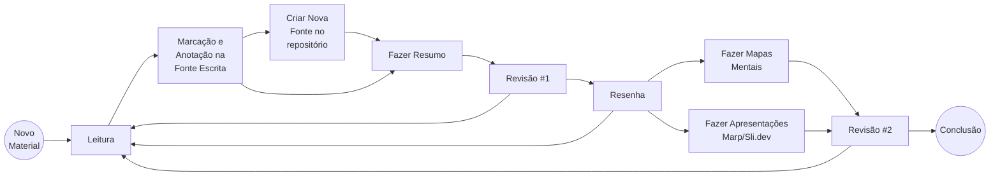
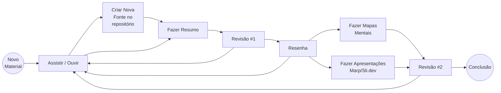
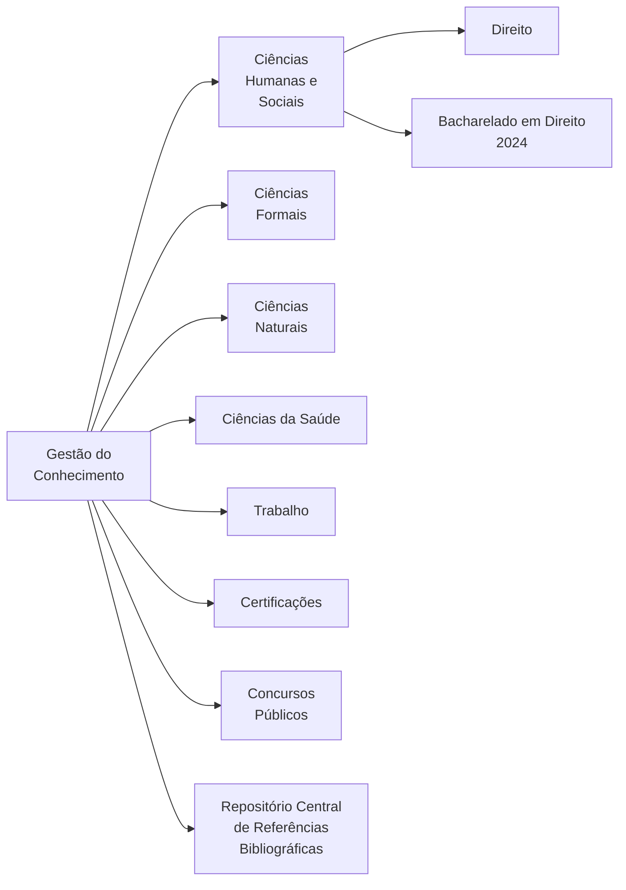
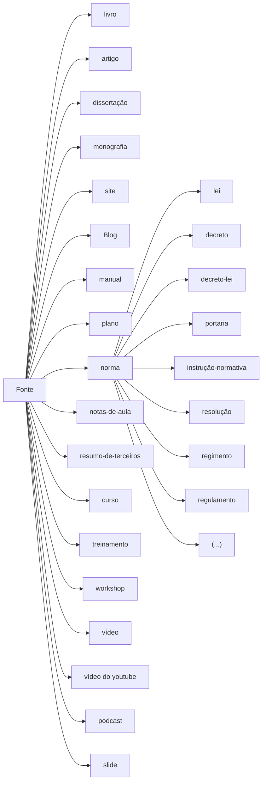
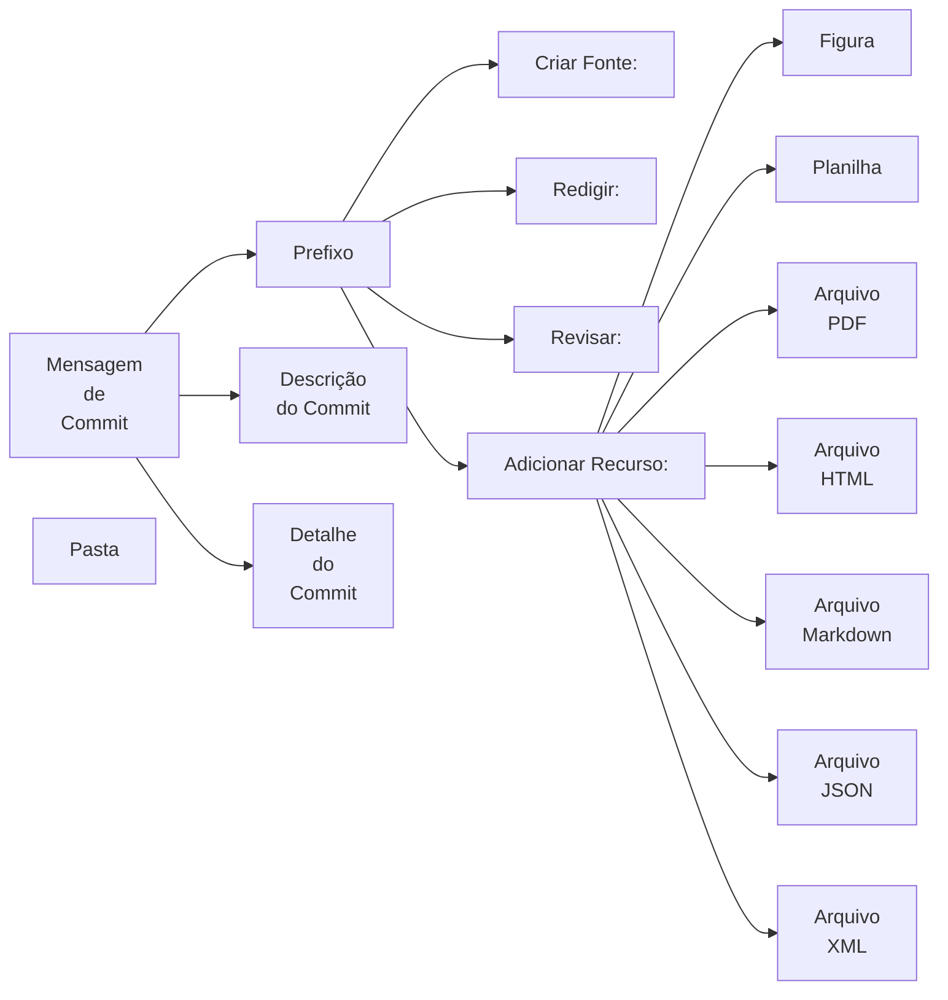

# Gestão do Conhecimento

<table align="right" border="0">
  <tr>
    <td align="center" valign="top">
      <a href="https://github.com/dnlclaudino/gestao-do-conhecimento#readme">
         Início da  Gestão do  Conhecimento
      </a>
    </td>
    <!--
    <td align="center" valign="top">
      <a href="https://github.com/dnlclaudino/gestao-do-conhecimento#readme">
         Início deste  Repositório
      </a>
    </td>
    -->
    <td align="center" valign="top">
      <a href="https://github.com/dnlclaudino/gestao-do-conhecimento#readme">
         Baixar em PDF
      </a>
    </td>
  </tr>
</table>     

Este documento estabelece diretrizes para minha gestão do conhecimento com vistas ao meu desenvolvimento pessoal e profissional.

|Contribuição|Data|Versão|Observações &#47; Notas |
|:---:|:---:|:---:|:---|
|Daniel Claudino|15/06/2023|v0.0.1|Versão Inicial do documento|

## Sobre mim

<table align="center" border="0">
<tr>
  <td align="center">
      <a href=https://dnlclaudino.github.io/">
       
    <b>Daniel Claudino ( Página Pessoal )</a></b></td>
  <td align="center">
    <a href="https://github.com/dnlclaudino/curriculum-vitae#readme">
     Curriculum Vitae</a>
  </td>
</tr>
</table>
  
## Necessidades

|#|Necessidade|
|:---:|:---|
|1|Tornar meu conhecimento explicitamente registrado|
|2|Otimizar a recuperação do meu conhecimento|
|3|Organizar meus conhecimentos pessoais e profissionais mais relevantes|
|4|Demonstrar minhas habilidades de gestão do conhecimento e gestão de minhas competências|
|5|Demonstrar atitudes que geram valores organizacionais, profissionais e sociais|
|6|Identificar e explicitar as competências organizacionais, acadêmicas, técnicas, gerenciais e individuais adquiridas com minha gestão do conhecimento|
|7|Contribuir no desenvolvimento de pessoas e organizações|

## Objetivos

|# Objetivo |Relacionado a Necessidade # | Descrição do Objetivo|
|:---:|:---|:---|
|1|#1, #2 e #3|Criar repositórios para cada tema, assunto, disciplina, tecnologia, metodologia, método ou boa prática cujo conhecimento será organizado e gerenciado em fontes|
|2|#6|Desenvolver texto apresentando a relação entre a gestão do conhecimento e a gestão de competências adquiridas|
|3|#1,#2,#3,#5 e #7|Desenvolver apresentação (Marp/Slide.dev/PPTXs) para facilitar a comunicação e compreensão desta gestão do conhecimento.|
|4|(...)|(...)|

- Mais **OBJETIVOS** serão formalmente apontados na medida em que os trabalhos de gestão do conhecimento forem avançando.

## Trilha de Aprendizagem

Minha gestão do conhecimento foi pensada para funcionar da seguinte forma:

### Quando a Fonte é ESCRITA

- **Observação**: A **revisão** e a **resenha**, normalmente ocorrem no mesmo arquivo.

### Quando a Fonte NÃO É ESCRITA

- **Observação**: A **revisão** e a **resenha**, normalmente ocorrem no mesmo arquivo.

## Fontes deste Repositório

Esse repositório foi construído com base no conhecimento adquirido principalmente das fontes relacionadas abaixo:
 
| # | Tipo Fonte | Nome da Fonte | Progresso | Data | Versão | Links | Anotações |
|:---:|:---:|:---|:---:|:---:|:---:|:---|:---|
| 1 | Vídeo-Aulas da Disciplina Fundamentos da Gestão do Conhecimento no YOUTUBE |**UNIVESP** [Vídeo-Aulas: Fundamentos da Gestão do Conhecimento](./aula-video-YOUTUBE-UNIVESP-2017-fundamentos-da-gestao-do-conhecimento/README.md) | 0% | Junho/2023 | v0.0.1 | 1. [Playlist das Aulas](https://www.youtube.com/playlist?list=PLxI8Can9yAHcfJ3BzblnmWBeDApWMFevY) | - |

## Gestão de Competências

Toda a minha gestão do conhecimento comunica-se com minha gestão de competências. Minha gestão de competências é orientada por linhas gerais direcionadoras (= política) representadas por declarações escritas a respeito das minhas intenções em relação aos meus conhecimentos, habilidades e atitudes, proporcionando linhas mestras para se atingir os meus objetivos pessoais, profisionais e da organizacção em que atuo, orientando decisões e a formulação de objetivos e elaboração de outras orientações relacionadas à própria gestão do conhecimento e à própria gestão de competências.

Para mais detalhes acesse minha política de gestão de competências no repositório "[Gestão de Competências](https://github.com/dnlclaudino/gestao-de-competencias/tree/master)".

## Áreas para Minha Gestão do Conhecimento

Todo os conhecimentos que foram considerados relevantes para minha gestão do conhecimento e minha gestão de competências pessoal, profissional e organizacional em que atuo são relacionados abaixo.

Pretende-se realizar um trabalho contínuo de revisão e aperfeiçoamento para que ela seja categorizada cada vez mais de forma técnica.

<table>
  <tr>
    <td align="center">
        
       <b>Atenção</b>
    </td>
    <td valign="top">
      Sempre que adicionar novas <b>Áreas do conhecimento</b>, atualizar o 
      <a href="https://github.com/dnlclaudino/repositorio-central-referencias-bibliograficas/tree/master">Repositório Central de Referências Bibliográficas</a>
    </td>
  </tr>
</table>

A ciência engloba um vasto conjunto de conhecimentos organizados, que se distribuem em três ramos principais[^CONCEITOS-DO-MUNDO-2023]. Atendendo ao que entendo ser o melhor critério atual de classificação, a minha gestão de conhecimento, será dividida da seguinte forma:

### Ciências Humanas e Sociais

Também conhecido como ciências humanas, este conjunto de disciplinas se dedica ao estudo da humanidade, mas preservando uma perspectiva empírica, crítica, orientada pelo método científico. Está, bem, afastado das humanidades e do mundo da subjetividade, mas também do mundo experimental, recorrendo antes à estatística, à transdisciplinaridade e à análise do discurso . Exemplos deste tipo de ciência são: sociologia , antropologia , ciência política , economia , geografia , etc.

Os repositório relacionados com o Direito, foram separados a parte para facilitar sua organização e localização.

|Ramo do Conhecimento|Sub-ramo do Conhecimento|Repositório de Conhecimento|Descrição|Link|
|:---|:---|:---|:---|:---|
|CIÊNCIAS HUMANAS E SOCIAIS|Administração|Auditoria|-|-|
|CIÊNCIAS HUMANAS E SOCIAIS|Administração|[Gestão do Conhecimento](https://github.com/dnlclaudino/gestao-do-conhecimento)|-|-|
|CIÊNCIAS HUMANAS E SOCIAIS|Administração|[Gestão de Pessoas](https://github.com/dnlclaudino/gestao-de-pessoas)|-|-|
|CIÊNCIAS HUMANAS E SOCIAIS|Administração|Gestão de Projetos [Meus Projetos e Planos](https://github.com/dnlclaudino/programas-projetos-e-planos)|-|-|
|CIÊNCIAS HUMANAS E SOCIAIS|Administração|Gestão de Processos de Trabalho|-|-|
|CIÊNCIAS HUMANAS E SOCIAIS|Administração|Governança|-|-|
|CIÊNCIAS HUMANAS E SOCIAIS|Administração|[Gestão de Serviços de TI](https://github.com/dnlclaudino/gerenciamento-de-servicos-de-ti)|-|-|
|CIÊNCIAS HUMANAS E SOCIAIS|Administração|[História dos Produtos e das Organizações](https://github.com/dnlclaudino/historia-dos-produtos-e-das-organizacoes)|-|-|
|CIÊNCIAS HUMANAS E SOCIAIS|Administração|[Logística](https://github.com/dnlclaudino/logistica)|-|-|
|CIÊNCIAS HUMANAS E SOCIAIS|Administração|[Planejamento](https://github.com/dnlclaudino/planejamento)|-|-|
|CIÊNCIAS HUMANAS E SOCIAIS|Administração|[Plano de Negócio #1](https://github.com/dnlclaudino/plano-de-negocio-1)|-|-|
|CIÊNCIAS HUMANAS E SOCIAIS|Administração|[Teoria Geral da Administração](https://github.com/dnlclaudino/teoria-geral-da-administracao)|-|-|
|CIÊNCIAS HUMANAS E SOCIAIS|Contabilidade|[Contabilidade](https://github.com/dnlclaudino/contabilidade)|-|-|
|CIÊNCIAS HUMANAS E SOCIAIS|Economia|Economia|-|-|
|CIÊNCIAS HUMANAS E SOCIAIS|Filosofia|[Filosofia](https://github.com/dnlclaudino/filosofia#readme)|-|-|
|CIÊNCIAS HUMANAS E SOCIAIS|Geografia|[Geografia](https://github.com/dnlclaudino/geografia#readme)|-|-|
|CIÊNCIAS HUMANAS E SOCIAIS|História|[História](https://github.com/dnlclaudino/historia#readme)|-|-|
|CIÊNCIAS HUMANAS E SOCIAIS|Psicologia|[Psicologia](https://github.com/dnlclaudino/psicologia#readme)|-|-|
|CIÊNCIAS HUMANAS E SOCIAIS|Sociologia|[Sociologia](https://github.com/dnlclaudino/sociologia#readme)|-|-|

#### Direito

|Ramo do Conhecimento|Sub-ramo do Conhecimento|Repositório de Conhecimento|Descrição|Link|
|:---|:---|:---|:---|:---|
|CIÊNCIAS HUMANAS E SOCIAIS|Direito|[Ciência Política e Teoria Geral do Estado](https://github.com/dnlclaudino/ciencia-politica-e-tge#readme)|-|-|
|CIÊNCIAS HUMANAS E SOCIAIS|Direito|[Direito Administrativo](https://github.com/dnlclaudino/direito-administrativo)|-|-|
|CIÊNCIAS HUMANAS E SOCIAIS|Direito|[Direito Civil](https://github.com/dnlclaudino/direito-civil#readme)|-|-|
|CIÊNCIAS HUMANAS E SOCIAIS|Direito|[Direito Constitucional](https://github.com/dnlclaudino/direito-constitucional#readme)|-|-|
|CIÊNCIAS HUMANAS E SOCIAIS|Direito|Direito Empresarial|-|-|
|CIÊNCIAS HUMANAS E SOCIAIS|Direito|Direito Humanos|-|-|
|CIÊNCIAS HUMANAS E SOCIAIS|Direito|[Direito Penal](https://github.com/dnlclaudino/direito-penal#readme)|-|-|
|CIÊNCIAS HUMANAS E SOCIAIS|Direito|Direito Trabalhista|-|-|
|CIÊNCIAS HUMANAS E SOCIAIS|Direito|Filosofia do Direito|-|-|
|CIÊNCIAS HUMANAS E SOCIAIS|Direito|Hermenêutica Jurídica|-|-|
|CIÊNCIAS HUMANAS E SOCIAIS|Direito|[Introdução ao Estudo do Direito](https://github.com/dnlclaudino/introducao-ao-estudo-do-direito#readme)|-|-|
|CIÊNCIAS HUMANAS E SOCIAIS|Direito|[Normas Jurídicas](https://github.com/dnlclaudino/normas-juridicas#readme)|-|-|
|CIÊNCIAS HUMANAS E SOCIAIS|Direito|Sociologia Jurídica|-|-|
|CIÊNCIAS HUMANAS E SOCIAIS|Direito|Psicologia Jurídica|-|-|
|CIÊNCIAS HUMANAS E SOCIAIS|Direito|Teoria Geral do Processo|-|-|

#### Outras Áreas de Humanas: Linguística

|Ramo do Conhecimento|Sub-ramo do Conhecimento|Repositório de Conhecimento|Descrição|Link|
|:---|:---|:---|:---|:---|
|CIÊNCIAS HUMANAS E SOCIAIS|Linguística|[Português &#124; Redação &#124; Inglês](https://github.com/dnlclaudino/linguistica#readme)|-|-|
|CIÊNCIAS HUMANAS E SOCIAIS|Linguística|[Literatura](https://github.com/dnlclaudino/literatura)|-|-|

#### Outras Áreas de Humanas

|Ramo do Conhecimento|Sub-ramo do Conhecimento|Repositório de Conhecimento|Descrição|Link|
|:---|:---|:---|:---|:---|
|CIÊNCIAS HUMANAS E SOCIAIS|Metodologia Científica|[Metodologia Científica e da Pesquisa]()|-|-|
|CIÊNCIAS HUMANAS E SOCIAIS|Padronizações|[Normas Nacionais e Internacionais ISOs/NBRs/RFCs](https://github.com/dnlclaudino/normas-de-padronizacao-nacional-internacional)|-|-|

### Bacharelado em Direito

Em razão da quantidade e complexidade de subrepositórios necessários para organizar todo o material relacionado com o curso de [Bacharelado em Direito](https://github.com/dnclaudino/bacharelado-em-direito#readme), eles foram agrupados nesse local específico.

### Ciências Formais

Ao contrário das ciências naturais, as formais não se dedicam ao estudo da natureza, mas de objetos e sistemas puramente abstratos, mas que podem ser aplicados ao mundo real. Assim, seus objetos de estudo existem apenas no mundo da mente, e sua validade não deriva de experimentos, mas de axiomas, raciocínios e inferências. Exemplos deste tipo de ciência são: matemática , lógica , ciência da computação , etc.

|Ramo do Conhecimento|Sub-ramo do Conhecimento|Repositório de Conhecimento|Descrição|Link|
|:---|:---|:---|:---|:---|
|CIÊNCIAS FORMAIS|[Computação](./computacao.md)|- ( ... )|-|-|
|CIÊNCIAS FORMAIS|Matemática|[Estatística](https://github.com/dnlclaudino/estatistica)|-|-|
|CIÊNCIAS FORMAIS|Matemática|Cálculo|-|-|
|CIÊNCIAS FORMAIS|Matemática|Cálculo Vetorial|-|-|
|CIÊNCIAS FORMAIS|Matemática|[Ensino Fundamental](https://github.com/dnlclaudino/matematica-ensino-fundamental)|-|-|
|CIÊNCIAS FORMAIS|Matemática|[Ensino Médio](https://github.com/dnlclaudino/matematica-ensino-medio)|-|-|
|CIÊNCIAS FORMAIS|Matemática|Geometria Analítica|-|-|
|CIÊNCIAS FORMAIS|Matemática|[Raciocínio Lógico e Matemático](https://github.com/dnlclaudino/raciocinio-logico-e-matematico)|-|-|

### Ciências Naturais e da Saúde

Este é o nome dado a todas as disciplinas científicas que se dedicam ao estudo da natureza, utilizando o método científico para reproduzir experimentalmente (isto é, sob condições controladas) os fenômenos que lhes interessam. Também são conhecidas como ciências experimentais, ciências exatas ou ciências físico-naturais e são exemplos disso: biologia , física , química , astronomia , geologia , etc.

|Ramo do Conhecimento|Sub-ramo do Conhecimento|Repositório de Conhecimento|Descrição|Link|
|:---|:---|:---|:---|:---|
|CIÊNCIAS NATURAIS|Física (Ensino Médio)|[Fisica 1](https://github.com/dnlclaudino/fisica-1)|-|-|
|CIÊNCIAS NATURAIS|Física (Ensino Médio)|[Fisica 2](https://github.com/dnlclaudino/fisica-2)|-|-|
|CIÊNCIAS NATURAIS|Física (Ensino Médio)|[Fisica 3](https://github.com/dnlclaudino/fisica-3)|-|-|
|CIÊNCIAS NATURAIS|Química (Ensino Médio)|[Química 1](https://github.com/dnlclaudino/quimica-1)|-|-|
|CIÊNCIAS NATURAIS|Química (Ensino Médio)|[Química 2](https://github.com/dnlclaudino/quimica-2)|-|-|
|CIÊNCIAS NATURAIS|Química (Ensino Médio)|[Química 3](https://github.com/dnlclaudino/quimica-3)|-|-|
|CIÊNCIAS NATURAIS|Biologia (Ensino Médio)|[Biologia 1](https://github.com/dnlclaudino/biologia-1)|-|-|
|CIÊNCIAS NATURAIS|Biologia (Ensino Médio)|[Biologia 2](https://github.com/dnlclaudino/biologia-2)|-|-|
|CIÊNCIAS NATURAIS|Biologia (Ensino Médio)|[Biologia 3](https://github.com/dnlclaudino/biologia-3)|-|-|

### Ciências da Saúde

|Ramo do Conhecimento|Sub-ramo do Conhecimento|Repositório de Conhecimento|Descrição|Link|
|:---|:---|:---|:---|:---|
|CIÊNCIAS DA SAÚDE|Medicina|[Anatomia](https://github.com/dnlclaudino/anatomia)|-|-|
|CIÊNCIAS DA SAÚDE|Medicina|[Farmacologia](https://github.com/dnlclaudino/farmacologia)|-|-|
|CIÊNCIAS DA SAÚDE|Medicina|[Fisiologia](https://github.com/dnlclaudino/fisiologia)|-|-|

### Gestão dos Conhecimentos Relacionados ao Trabalho

- Para acessar a gestão do conhecimento relacionado ao trabalho, acesse a fonte [TRE-PB/SEINF](./tre-pb/README.md) deste repositório.

## Imagens/Ícones Utilizados

- Consulte [repositório público imagens](https://github.com/dnlclaudino/imagens):
  - [História](https://github.com/dnlclaudino/historia/blob/master/imagens/referencias-bibliograficas.md)
  - [Gestão do Conhecimento](https://github.com/dnlclaudino/imagens/tree/master)
  - [Pessoas](https://github.com/dnlclaudino/imagens/tree/master/pessoas)
  - [Obras de Arte](https://github.com/dnlclaudino/imagens/tree/master/obras-de-arte)

## Recursos Adicionais

São recursos adicionais utilizados nos resumos

|**Recurso**|**Descrição**|
|:---:|:---|
| **VS Code**|Editar aquivos markdown dos repositórios, fontes, capítulos, partes, etc.|
| **Extensões do VS Code**|Veja seção [extensões do VS CODE](#extensoes-do-vs-code)|
| **Geogebra**|Ferramenta matemática para geometria e algebra|
| **Draw.io**|Fluxogramas e esquemas|
| **BPMN.io**|Mapeamento de processos usando notação BPMN|
| **Sli.dev**|Existem inúmeras ferramentas para criar slides cheias de recurso, de uso geral, como Microsoft PowerPoint e Apple Keynote. Elas funcionam muito bem para fazer slides legais com animações, gráficos, e muitas outras coisas, além de serem bem intuitivas e fáceis de aprender. Então por que gastar tempo fazendo o Slidev? O Slidev visa fornecer a flexibilidade e a interatividade para desenvolvedores fazerem suas apresentações ainda mais interessantes, expressivas, e atraentes usando ferramentas e tecnologias das quais já estão familiarizados.|
| **MARP.app**|Outra ferramenta de elaboração de slides que permite versionamento e a separação entre a camada de conteúdo e a camada de apresentação|
| **Mermaid**|Recurso para criar diagramas usando Markdown|
| **Power Point**|Apresentações elaboradas com o software **Power Point** da Microsoft|
| **Mesa Digitalizadora** **One by Wacom**|Desenhos e anotações em formato PNG construídas à mão livre, feitas com a mesa digitalizadora da Wacom.|

### Extensões do VS Code

## A Hierarquia dos Repositórios

1. O primeiro nível do repositório corresponderá a um tema, assunto, disciplina, tecnologia, metodologia, método ou boa prática;
    - No primeiro nível será criado o arquivo “README.md” contendo um documento markdown de sumário contendo manifesto (o que o repositório contém), uma tabela com as versões com descrições (TAGS) e outra tabela com as relações de partes do do resumo com seus respectivos links ;
2. O segundo nível na hierarquia do repositório será a FONTE do material a ser resumido (livro, artigo, dissertação, monografia, site, manual,plano, norma [lei, decreto,portaria, resolução, regimento interno, regulamento] , notas-de-aula, resumo-de-terceiros, curso, workshop, vídeo, video youtube, podcast, slide, etc)

<b>Figura:</b> hierarquia de fontes neste repositório

3. Outras Orientações:
    - Cada pasta FONTE conterá um arquivo README.md contendo sumário com (o que o FONTE contém) e uma tabela com as relações de partes do do resumo com - seus respectivos links;
    - Cada pasta FONTE conterá pastas para os RECURSOS agregados aos resumos e conhecimento registrados:
    - Uma pasta chamada “figuras” para armazenar imagens a serem utilizadas nesse terceiro nível;
    - Uma pasta chamada “planilhas” para armazenar planilhas eletrônicas
    - Uma pasta chamada "codigo-fonte" para armazenar códigos-fonte;
    - Obs: podem haver outras pastas para armazenar outros RECURSOS, devendo ser seguido as regras de nomenclatura de PASTAS explicitadas mais adiante;

4. O terceiro nível na hierarquia do repositório conterá pastas para cada capítulo, unidade, artigo, documento, etc a ser resumido em um arquivo markdown (*.MD)

## Fluxo Principal de Trabalho para Elaboração de Resumos e Resenhas

Deve-se usar o Github e a conta “dnlclaudino@gmail.com” para criar e manter resumos e resenhas.

1. Deve-se identificar o tema, assunto, disciplina, tecnologia, metodologia, método a ser resumido(a) ou resenhado(a).
2. Verificar se já existe um repositório (Github) para o resumo
    - Caso não exista, criar um subrepositório no Github;
    - Mantenha o padrão da gestão do conhecimento, incluindo seção "**Versão da Política de Gestão do Conhecimento**" e texto-padrão: "A versão da [Política de Gestão do Conhecimento](https://github.com/dnlclaudino/gestao-do-conhecimento/tree/master) utilizada é v0.0.1. As [regras para realização de commits](https://github.com/dnlclaudino/gestao-do-conhecimento/blob/master/README.md#regras-para-nomenclatura-de-commits-no-github) estão disponíveis em Regras para commits no Github.";
    - Incluir seção "**Competências Relacionadas com Este Repositório**", seguindo as orientações contidas na minha Gestão por Competências, na seção [Descrição das Competências](https://github.com/dnlclaudino/gestao-de-competencias/blob/master/README.md#descri%C3%A7%C3%A3o-das-compet%C3%AAncias);
      - Incluir texto:"-  O estudo de todas as fontes desse repositório:"
       - Incluir texto:"  - Poderão possibilitar o desenvolvimento de competências:"
       - Incluir texto:"  - Organizacionais (CPT-O-);"
       - Incluir texto:"  - Acadêmicas (CPT-A-);"
       - Incluir texto:"  - Técnicas (CPT-T-);"
       - Incluir texto:"  - Gerenciais (CPT-G-); e/ou"
       - Incluir texto:"  - Individuais (CPT-I-)"
      - Incluir texto:"- Desenvolveram efetivamente as seguintes competências organizacionais, acadêmicas, técnicas, gerenciais e/ou individuais:"
      - Incluir **uma subseção** para cada competência
        - Incluir tabela (veja template do repositório) para competência da subseção criada.
    - Incluir seção "**Navegação nos arquivos deste repositório**"
      - Incluir texto: "Este repositório segue as regras estabelecidas na **Gestão do conhecimento** na seção [Regras para cada Repositório ou Subrepositório](https://github.com/dnlclaudino/gestao-do-conhecimento?tab=readme-ov-file#regras-para-cada-reposit%C3%B3rio-ou-subreposit%C3%B3rio)"
      - Incluir texto conforme o repositório: "Os arquivos PDFs do atual repositório ficarão localizados em **ONEDRIVE.COM** > **MEUS ARQUIVOS** > **GESTÃO DE COMPETÊNCIAS** > **GESTÃO DO CONHECIMENTO** > "**<u>[INTRODUÇÃO AO ESTUDO DO DIREITO](https://1drv.ms/f/s!Au-CrfNP6c0bhqdXWk-Cr9JgI9mFFQ?e=MGgAKi)</u>**" > "<u>**NOME-DA-FONTE**</u>" > "**<u>NOME-DA-PARTE-OU-CAPITULO.PDF</u>**"."
    - Incluir seção "**Referências Bibliográficas**" no final do arquivo README.md do repositório:
      - Incluir o seguinte texto: "As referências bibliográficas das fontes deste repositório encontram-se no [Repositório Central de Referências Bibliográficas](https://github.com/dnlclaudino/repositorio-central-referencias-bibliograficas/tree/master)."
    - Incluir seção "**Licença**" antes da seção "Referências Bibliográficas":
      - O texto-padrão: "Este material está sob licença [Creative Commons CC BY-NC-SA 4.0](https://creativecommons.org/licenses/by-nc-sa/4.0/deed.pt_BR): esta licença permite que outros remixem, adaptem e criem a partir do seu trabalho para fins não comerciais, **desde que atribuam o devido crédito ao autor (Daniel Claudino)** e que licenciem as novas criações sob termos idênticos."
      - Você tem os seguintes direitos:
        - Compartilhar: copiar e redistribuir o material em qualquer suporte ou formato
        - Adaptar: remixar, transformar, e criar a partir do material
      - De acordo com os seguintes termos:
        - Atribuição — Você deve dar o crédito apropriado, prover um link para a licença e indicar se mudanças foram feitas. Você deve fazê-lo em qualquer circunstância razoável, mas de nenhuma maneira que sugira que o licenciante apoia você ou o seu uso.
        - Não Comercial — Você não pode usar o material para fins comerciais.
        - Compartilha Igual — Se você remixar, transformar, ou criar a partir do material, tem de distribuir as suas contribuições sob a mesma licença que o original.
      - Normalmente, sigo a licença [Creative Commons CC BY-NC-SA 4.0](https://creativecommons.org/licenses/by-nc-sa/4.0/deed.pt_BR)
      - Incluir o HTML abaixo em cada FONTE e no REPOSITÓRIO:

<table width="350px">
<tr>
<td align="center">
 A <b>Gestão do Conhecimento</b> de <a xmlns:cc="http://creativecommons.org/ns#" href="https://github.com/dnlclaudino/gestao-do-conhecimento" property="cc:attributionName" rel="cc:attributionURL">Daniel Claudino</a> está licenciado com uma Licença <a rel="license" href="http://creativecommons.org/licenses/by-nc/4.0/">Creative Commons - Atribuição-NãoComercial 4.0 Internacional</a>.
</td>
</tr>
</table>

  
1. Verificar se já existe a FONTE no repositório (Github) para o resumo
    - Caso não exista, **criar a FONTE** dentro do repositório;
    - Para NOMEAR a FONTE siga o padrao da <a href="#figura-hierarquia-de-fontes-neste-repositorio">hierarquia de fontes neste repositório</a>
2. Organizar CADA FONTE do repositório em ARQUIVOS (*.md). Um arquivo para cada capítulo, unidade, artigo, documento, etc a ser resumido;

    - Cada arquivo markdown (*.md) da FONTE deve segui a seguinte estrutura padrão:

- Deve-se seguir esse mesmo modelo de estrutura para um QUALQUER PARTE DE UMA FONTE qualquer que seja a sua denominação (seção, unidade, topico, etc...)
- Existe um GIST para os 03 icones que aparecem em todo início de arquivo markdown (*.md)
  - **Nome do Gist**: <a href="https://gist.github.com/dnlclaudino/cfe4f3be999afef36e720a7265a86b58">fonte-icones-no-inicio-arquivo.md</a>
  
1. O repositório do github deve conter
    - Um BRANCH chamada master para a versão final dos documentos (arquivos)
    - Deve ser criada uma branch chamada **redacao-’nome-da-fonte’-’nome-do-capitulo-unid-ou-parte’** para adição, alteração, remoção de texto do resumo
    - <u>**Não modificar diretamente a branch master !**</u>
2. Após a revisão do texto elaborado na branch desenvolvimento-’nome-da-fonte’-’nome-do-capitulo/unid.parte’’ , deve ser feito um merge com a branch master;
3. Após a conclusão do resumo de uma capítulo, unidade, parte do documento, etc:
    - Deve ser criado uma TAG no repositório com o número da versão e descrição do que foi resumido;
      - Obs: Seguir **regras de versionamento semântico** deste documento para denominação das TAGS
    - O arquivo “README.md” deve ser atualizado;

## Regras para versionamento semântico nos documentos

1. Usar o seguinte versionamento semântico:

    - MAJOR.MINOR.PATCH
    - PATCH -> Aumentar sempre que partes de um documento (arquivo) de resumo forem sendo entregues;
    - MINOR -> Sempre que um (arquivo) documento foi finalizado (capítulo, unidade, artigo, documento, etc)
    - MAJOR* -> Sempre que um mesmo tópico for resumido a partir de outra fonte

* Se após eu fizer um resumo de um manual do TCU sobre gestão de riscos (uma versão MAJOR), eu fizer um outro resumo sobre o mesmo tema (gestão de riscos) de um manual de gestão de riscos do CNJ (outra versão MAJOR acrescentada).

## Regras para cada Repositório ou Subrepositório

1. Local para Armazenamento dos arquivos PDFs
    - Conforme definido na **Gestão do Conhecimento**, cada repositório possui uma ou mais fontes (livros, apostilas, cursos, vídeos, normas, etc.). Cada fonte, por sua vez, possui um ou mais **partes** que podem ser capítulos, unidades, etc. Cada parte terá um arquivo PDF correspondente que poderá ser baixado separadamente. 
    - Optou-se por não colocar esses arquivos PDFs nos repositório do GITHUB, uma vez que ele tem um tamanho consideravelmente alto o que acabaria inviabilizando a manutenção de muitos repositórios na gestão do conhecimento facilmente em um futuro próximo (muitas partes/capítulos) de muitas fontes de muitos subrepositórios.
    - Optou-se, ainda, por armazenar esses arquivos em PDF no meu OneDrive em uma estrutura de pastas e arquivos localizados em **ONEDRIVE.COM** > **MEUS ARQUIVOS** > **GESTÃO DE COMPETÊNCIAS** > **GESTÃO DO CONHECIMENTO** > "**<u>NOME-DO-REPOSITÓRIO</u>**" > "<u>**NOME-DA-FONTE**</u>" > "**<u>NOME-DA-PARTE-OU-CAPITULO.PDF</u>**".
      - Por exemplo, os arquivos PDFs de um repositório "**INTRODUÇÃO AO ESTUDO DO DIREITO**" ficarão localizados em **ONEDRIVE.COM** > **MEUS ARQUIVOS** > **GESTÃO DE COMPETÊNCIAS** > **GESTÃO DO CONHECIMENTO** > "**<u>[INTRODUÇÃO AO ESTUDO DO DIREITO](https://1drv.ms/f/s!Au-CrfNP6c0bhqdXWk-Cr9JgI9mFFQ?e=MGgAKi)</u>**" > "<u>**NOME-DA-FONTE**</u>" > "**<u>NOME-DA-PARTE-OU-CAPITULO.PDF</u>**".

2. No arquivo **README.md** de cada **REPOSITÓRIO**, logo no início e antes do seu título, devem constar os ícones e links abaixo:

<table align="right" border="0">
  <tr>
    <td align="center" valign="top">
      <a href="https://github.com/dnlclaudino/gestao-do-conhecimento#readme">
         Início da  Gestão do  Conhecimento
      </a>
    </td>
    <td align="center" valign="top">
       Baixar em PDF
    </td>
  </tr>
</table>       

3. Navegação nos arquivos em cada repositório:
    - Em todos os arquivos markdown (*.md) deste repositório, serão disponibilizados os ícones abaixo, no ínício e canto superior direito de cada arquivo, para uma navegação básica para **página inicial da fonte** e para **página inicial da minha gestão do conhecimento**. Após a conclusão da redação de cada arquivo deste repositório, o ícone **Baixar em PDF** apontará para o arquivo PDF que será gerado possibilitando obter o conteúdo também no formato PDF.

<table align="right" border="0">
  <tr>
    <td align="center" valign="top">
      <a href="https://github.com/dnlclaudino/gestao-do-conhecimento#readme">
         Início da  Gestão do  Conhecimento
      </a>
    </td>
    <td align="center" valign="top">
      <a href="https://github.com/dnlclaudino/introducao-ao-estudo-do-direito#readme">
         Início deste  Repositório
      </a>
    </td>
    <td align="center" valign="top">
      <a href="https://github.com/dnlclaudino/introducao-ao-estudo-do-direito#readme">
         Baixar em PDF
      </a>
    </td>
  </tr>
</table>     

## Regras para Fontes e sua Nomenclatura

1. Todas as letras em minúscula;
2. As palavras não devem conter acentos diacríticos (agudo, circunflexo,crase,etc);
3. Palavras separadas por hífen “-”;
4. Para nomenclatura de FONTES
    - Elementos:
      - Tipo da fonte: livro, livro-treinamento,apostila-treinamento,slide-treinamento,livro-curso,apostila-curso,slide-curso, artigo, dissertação, monografia, site, manual,plano, norma [lei, decreto,portaria, resolução, regimento-interno, regulamento], notas-de-aula, resumo-de-terceiros, curso, treinamento, workshop, vídeo-aula, podcast, slide, etc (sem acentos diacríticos);
      - Sobrenome dos autores (pessoa física, ou pessoa jurídica quando institucional) em MAIÚSCULA separados por hífen “-”
      - Ano com quatro dígitos;
      - Uma descrição com o título da fonte (separadas por hífen e sem sinais diacríticos). Encurtar, se necessário.

5. Exemplos:
      - Livros
        - livro-SAYER-WILLIANS-2015-lean-para-leigos
        - livro-SIQUEIRA-2014-certificacao-lpi-1
        - livro-GUEDES-2018-uml-2-uma-abordagem-pratica
      - Cursos
        - curso-ENAP-2023-gerenciamento-de-servicos-de-ti 
        - curso-CNJ-2023-analise-de-dados-com-r
        - curso-CNJ-2023-analise-de-dados-com-excel
      - Normas
        - portaria-TRE-PB-14-2019-regulamento-interno-da-secretaria 
        - resolucao-CNJ-324-2020-diretrizes-para-gestao-documental-e-da-memoria-no-poder-judiciario
      - Manuais
        - manual-CNJ-2020-manual-de-gestao-documental
        - manual-CNJ-2020-manual-de-digitalizacao-de-documentos
        - manual-TSE-2021-manual-de-gestao-documental
        - manual-TSE-2021-manual-de-digitalizacao-de-documentos
6. No arquivo **README.md** de cada **FONTE**, logo no início e antes do seu título, deve constar os ícones e links abaixo:

<table align="right" border="0">
  <tr>
    <td align="center" valign="top">
      <a href="https://github.com/dnlclaudino/gestao-do-conhecimento#readme">
         Início da  Gestão do  Conhecimento
      </a>
    </td>
    <td align="center" valign="top">
      <a href="https://github.com/dnlclaudino/introducao-ao-estudo-do-direito#readme">
         Início deste  Repositório
      </a>
    </td>
    <td align="center" valign="top">
      <a href="https://github.com/dnlclaudino/introducao-ao-estudo-do-direito#readme">
         Baixar em PDF
      </a>
    </td>
  </tr>
</table>     

## Regra para Cada Arquivo .MD de uma FONTE

1. No arquivo **NOME-DO-ARQUIVO.md**, em cada **ARQUIVO** de cada **FONTE**, logo no início e **DEPOIS** do seu título, deve constar os ícones e links abaixo:

<table align="right" border="0">
  <tr>
    <td align="center" valign="top">
      <a href="https://github.com/dnlclaudino/introducao-ao-estudo-do-direito/tree/master/livro-NADER-2016-introducao-ao-estudo-do-direito#readme">
         Sumário da Fonte
      </a>
    </td>
    <td align="center" valign="top">
      <a href="https://github.com/dnlclaudino/introducao-ao-estudo-do-direito#readme">
         Início deste  Repositório
      </a>
    </td>
    <td align="center" valign="top">
         Baixar em PDF
    </td>
  </tr>
</table>     

## Regras para nomenclatura de pastas e documentos de resumo

1. Todas as letras em minúscula;
2. As palavras não devem conter acentos diacríticos (agudo, circunflexo, cedilha, crase,etc);
3. Palavras separadas por hífen “-”;
4. Para nomenclatura de PASTAS
      - Escolha uma nomenclatura que reflita de forma suficientemente genérica o tema / assunto / disciplina / tecnologia / metodologia / método / boa prática
5. Para nomenclatura de ARQUIVOS
    - Caso o objeto do resumo seja dividido em CAPÍTULOS
      - Elementos:
        - A expressão “capitulo”
        - O número do capítulo/parte com dois dígitos;
        - Uma descrição breve do capítulo;
      - Exemplo.:
         - capitulo-02-conhecendo-o-gerenciamento-de-Servicos.MD
      - Caso o objeto do resumo seja dividido em < ESPECIFICAR A FORMA DE DIVISÃO >

## Regras para nomenclatura de imagens

1. Todas as letras em minúscula;
2. As palavras não devem conter acentos diacríticos (agudo, circunflexo,crase,etc);
3. Palavras separadas por hífen “-”;
4. Para nomenclatura de ARQUIVOS DE IMAGENS
    - Caso o objeto do resumo seja dividido em CAPÍTULOS
      - Elementos:
         - A expressão ‘figura’
         - O número do capítulo/parte com dois dígitos;
          - Uma descrição breve da figura;
      - Exemplo.:
      - figura-02-classificacao-das-tipologias-de-servicos.PNG
    - Caso o objeto do resumo seja dividido em < ESPECIFICAR A FORMA DE DIVISÃO >

## Regras para nomenclatura de tabelas e quadros

1. Para nomenclatura de TABELAS e QUADROS
    - Caso o objeto do resumo seja dividido em CAPÍTULOS
      - Elementos:
        - A expressão ‘Tabela’;
        - Um hífen “-”;
        - Uma descrição breve da tabela com todos os sinais diacríticos pertinentes;
    - Exemplo.:
      - Tabela - Classificação das tipologias de serviços

## Regras para commits no Github

### Orientações gerais

- Os **commits** devem ter entre 50 a 60 caracteres
- A mensagem de commit deve começar com um **prefixo** seguindo de dois pontos;
- O prefixo deve expressar a **razão (o porquê) de realizar o commit**;
- Commits com mais de uma razão diferente devem ser divididos em tantos commits quantas razões diferentes existirem;
- Commits devem deixar claro a parte que está sendo construída, revisada ou removida do produto final;

### Como descrever um Commits ?

1. Prefixos
  - Prefixo "Criar Fonte"
  - Prefixo "Redigir"
  - Prefixo "Revisar"
  - Prefixo "Adicionar Recurso"
2. Descrição do Commit
  - Deixar claro a parte do documento que está sendo editada;
  - Descreva brevemente a figura ou arquivo e a sua relevância para o documento;
3. Detalhes do Commit

- O Prefixo **REVISAR** deve ser usado para as seguintes formatações e alterações no documento:
  - Formatações: Formatar um documento significa:
    - Estabelecer/Alterar o alinhamento;
    - Inclusão/Exclusão de hiperlinks no texto;
    - Estabelecer/Alterar espaçamento;
    - Estabelecer/Alterar as margens do texto;
    - Estabelecer/Alterar as fontes, negrito, itálico ou cores;
    - Estabelecer/Alterar alteração de caixa baixa para caixa alta;
    - Dividir em dois ou mais parágrafos a partir de um parágrafo já existente;
    - Aglutinar em um parágrafo a partir de dois ou mais parágrafos já existentes;
    - Criar/Alterar lista ordenada/não ordenada de itens já existentes
    - Entre outras ações, de forma a obter um documento de acordo com as preferências do utilizador.

## Como incluir um novo tema no repositório

Por tema entende-se tema, assunto, disciplina, tecnologia, metodologia, método, boa prática a ser resumida (veja lista em XXXXXX na forma de mapa mental). Antes de iniciar um novo tema, VERIFIQUE se já existe um repositório para o tema. (No Github)

### Passo a passo 

1. Siga as regras estabelecidas nessa política para [A hierarquia dos repositórios]() e [Fluxo de trabalho para elaboração de resumos]()
2. Siga as regas estabelecidas para [Regras para nomenclatura de fontes]() e [Regras para nomenclatura de fontes]()

## Repositório Central de Referências Bibliográficas

Existe um repositório centralizado de referências bibliográficas para toda minha gestão do conhecimento. Nele constam:

- As referência bibliográfica no formato [ABNT 6023]();
- As referência bibliográficas no formato [BibTEX](https://www.bibtex.org/)

## Referências Bibliográficas

[^CONCEITOS-DO-MUNDO-2023]: Ciência. Conceitos do Mundo. Disponível em: (https://conceitosdomundo.pt/ciencia/). Acessado em: 16 jul. 2023
