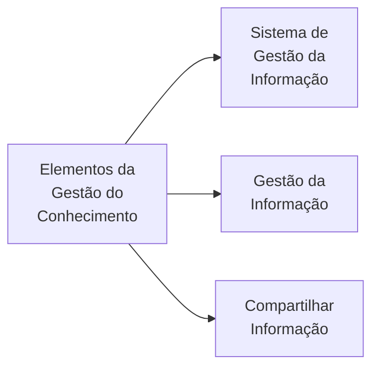
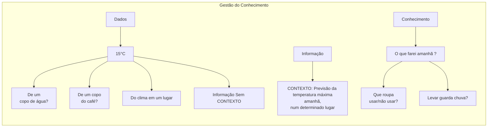
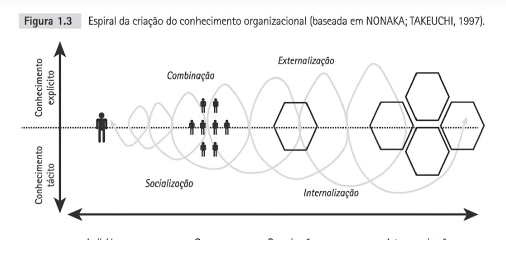

# Aula 01 - Fundamentos da Gestão do Conhecimento

link para aula: 

## Gestão do Conhecimento: O que É e o que NÃO É

- Gestão do conhecimento **NÃO É** sistema de gestão da informação;
- Gestão do conhecimento **NÃO É** gestão da informação;
- Gestão do conhecimento **NÃO É** compartilhar informação;
- Gestão do conhecimento **NÃO É** privilégio de grandes organizações;
- Gestão do conhecimento **NÃO SÓ** lida com **conhecimento explícito**, lida também com o **conhecimento implícito ou tácito**;

## Diferença entre DADO, INFORMAÇÃO e CONHECIMENTO

- **DADOS**: Fatos brutos. Registros;
- **INFORMAÇÕES**:
  - É a coleção de dados organizados de tal modo que eles têm valor, significado e fazem sentido;
  - São **DADOS dentro de um CONTEXTO**;
- **CONHECIMENTO**:
  - É a INFORMAÇÃO organizada para **TOMADA DE DECISÃO**;
  - São **informações com um PROPÓSITO**.
- **SABEDORIA**: É o **uso do conhecimento**:
  - Com responsabilidade;
  - Dentro de princípios e valores éticos e morais sustentáveis.

## Tipos de Conhecimento

- Conhecimento Explícito
  - É visível
  - É palpável;
  - É objetivo;
  - É expresso numa **LINGUAGEM**;
  - É transmitido por **PALAVAS** (oralmente ou escrito), **NÚMEROS**, **SINAIS**, etc.
  - LUGAR: Livros, Manuais, Roteiros, Bancos de dados, Sistemas, etc.
- Conhecimento Implícito ou Tácito;
  - É pessoal;
  - É individual;
  - É subjetivo;
  - É **DIFÍCIL DE ESPRESSAR**;
  - Está na mente do colaborador;
  - Está ligado:
    - Às experiências de cada um;
    - Às memórias de cada um;
    - Aos sentimentos de cada um;
    - Às habilidades de cada um;

## A Importância da Gestão do Conhecimento para as Organizações

- Final da **década de 80**:
  - **Peter Drucker**: "Os grandes ganhos de prudutividade daqui para frente, advirão das melhorias na Gestão do Conhecimento.";
  - **Michael Porter**: "As empresas **nunca podem parar de aprender** sobre o **setor em que atuam**, **suas rivais** ou **formas de melhorar ou modificar sua posição** competitiva

## O que é Gestão do Conhecimento ?

- É um processo SISTEMÁTICO, ARTICULADO e INTENCIONAL:
  - Apoiado na:
    - Geração **de conhecimentos**;
    - Codificação **de conhecimentos**;
    - Disseminação **de conhecimentos**;
    - Apropriação **de conhecimentos**;
  - Com o PROPÓSITO de:
    - Atingir a EXCELÊNCIA ORGANIZACIONAL;
- É o CONJUNTO formado por
  - PLANEJAMENTO, ORGANIZAÇÃO, MOTIVAÇÃO e CONTROLE:
    - De pessoas na organização;
    - De Processos na organização;
    - De sistemas na organização;
  - Para GARANTIR que os ATIVOS relacionados ao conhecimento:
    - Sejam MELHORADOS;
    - Efetivamente EMPREGADOS.

<b>Figura:</b> Espiral da criação do conhecimento nas organizações

<table align="center" width="650" id="nome-id-unico">
  <tr>
    <td align="center">
       
    </td>
  </tr>
</table>

<b>Fonte:</b> TAKEUCHI, Hirotaka. Criação de conhecimento na empresa. Elsevier Brasil, 2004.
