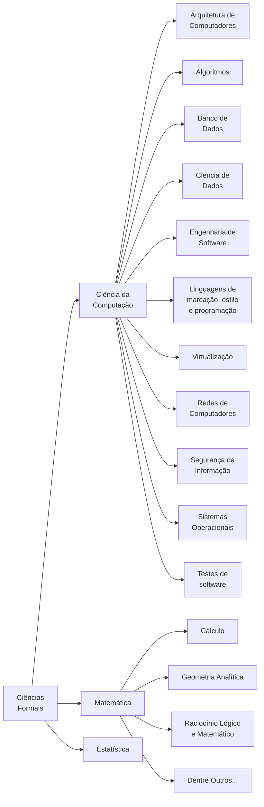
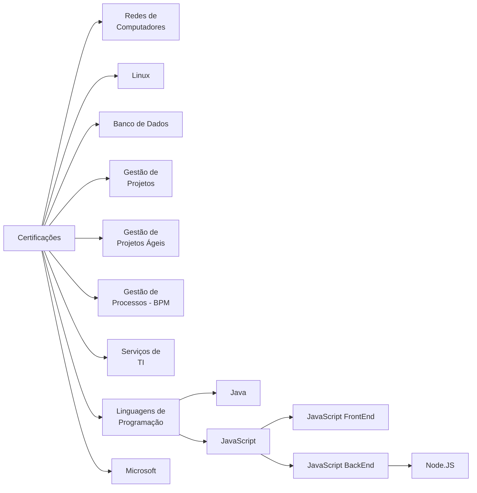

# Ciências da Computação

|Ramo do Conhecimento|Sub-ramo do Conhecimento|Repositório de Conhecimento|Descrição|Link|
|:---|:---|:---|:---|:---|
|CIÊNCIAS FORMAIS|Ciência da Computação|Arquitetura de Computadores|-|-|
|CIÊNCIAS FORMAIS|Ciência da Computação|Algoritmos|-|-|
|CIÊNCIAS FORMAIS|Ciência da Computação|Banco de Dados|-|-|
|CIÊNCIAS FORMAIS|Ciência da Computação|Ciencia de Dados|-|-|
|CIÊNCIAS FORMAIS|Ciência da Computação|[Engenharia de Software e UML](https://github.com/dnlclaudino/engenharia-de-software-e-uml)|-|-|
|CIÊNCIAS FORMAIS|Ciência da Computação|[Linguagens de marcação, estilo e programação](https://github.com/dnlclaudino/linguagens-marcacao-estilo-e-programacao)|-|-|
|CIÊNCIAS FORMAIS|Ciência da Computação|Virtualização|-|-|
|CIÊNCIAS FORMAIS|Ciência da Computação|[Redes de Computadores](https://github.com/dnlclaudino/redes-de-computadores-e-comunicacao-de-dados)|-|-|
|CIÊNCIAS FORMAIS|Ciência da Computação|[Segurança da Informação](https://github.com/dnlclaudino/seguranca-em-tecnologia-da-informacao)|-|-|
|CIÊNCIAS FORMAIS|Ciência da Computação|[Sistemas Operacionais](https://github.com/dnlclaudino/sistemas-operacionais)|-|-|
|CIÊNCIAS FORMAIS|Ciência da Computação|Testes de software|-|-|

**Obs**: Gestão e Governança de TI estão na seção de CIÊNCIAS HUMANAS E SOCIAIS > Administração. Normas relacionadas com a Ciência da Computação estarão na seção CIÊNCIAS HUMANAS E SOCIAIS.

### Certificações

Seja para melhorar as competências para acompanhar as mudanças de tecnologia, seja para obter maior satisfação no trabalho, ou até mesmo para que obter uma promoção, as certificações são essenciais hoje em dia.

Acesse o [repositório de certificações](https://github.com/dnlclaudino/certificacoes) contendo todas as fontes de todas as certificações relacionadas abaixo.

|Entidade|Área de Certificação|Certificação|Descrição|Custo|Período Preparatório|Período Realização|Anotações Observações|
|:---|:---|:---|:---|:---|:---|:---|:---|
|CISCO|Redes de Computadores|**ENTRY** &nbsp;&nbsp;a) CCST Cybersecurity;  &nbsp;&nbsp; b) CCST Networking; **ASSOCIATE**  &nbsp;&nbsp;a) Enterprise CCNA;  &nbsp;&nbsp; b) CyberOps Associate;  &nbsp;&nbsp; c) DevNet Associate  **PROFESSIONAL**  &nbsp;&nbsp;a) CyberOps Professional; &nbsp;&nbsp;b) CCNP Colaboration; &nbsp;&nbsp;c) CCNP Data Center; &nbsp;&nbsp;d) CCNP Enterprise; &nbsp;&nbsp;e) CCNP Security; &nbsp;&nbsp;f) CCNP Service Provider; &nbsp;&nbsp;g) DevNet Professional;  **EXPERT** &nbsp;&nbsp;a) CIEE Colaboraion; &nbsp;&nbsp;b) CIEE Data Center; &nbsp;&nbsp;c) CIEE Enterprise Infrastructure; &nbsp;&nbsp;d) CIEE Enterprise Wireless; &nbsp;&nbsp;e) CIEE Security; &nbsp;&nbsp;f) CIEE Service Provider; &nbsp;&nbsp;g) CIEE CCDE  **TREINAMENTO ADICIONAL** **Cisco Certified Technician (CCT)** &nbsp;&nbsp;- CCT Data Center &nbsp;&nbsp;- CCT Routing & Switching|-|-|-|-|- [Lista de Certificações](https://www.cisco.com/c/en/us/training-events/training-certifications/certifications.html)|
|Linux Professional Institute|Linux|- Acesse [aqui](https://www.lpi.org/our-certifications/summary-of-lpi-certifications/) |-|-|-|-|- [Orientações gerais](https://linuxsemfronteiras.com.br/certificacoes/?gclid=Cj0KCQjwzdOlBhCNARIsAPMwjbwT1jXGSCMYd6FRMiNdDlMhfPgb9RG5J1K3GIWI0CyJGwx6u0bDzkIaAlH1EALw_wcB)|
|Linux Foundation|Linux|- Acesse [aqui](https://training.linuxfoundation.org/full-catalog/?_sft_product_type=certification)|-|-|-|-|- [Orientações gerais](https://linuxsemfronteiras.com.br/certificacoes/?gclid=Cj0KCQjwzdOlBhCNARIsAPMwjbwT1jXGSCMYd6FRMiNdDlMhfPgb9RG5J1K3GIWI0CyJGwx6u0bDzkIaAlH1EALw_wcB)|
|CompTIA+|Linux|- Acesse [aqui](https://www.comptia.org/certifications)|-|-|-|-|- [Orientações gerais](https://linuxsemfronteiras.com.br/certificacoes/?gclid=Cj0KCQjwzdOlBhCNARIsAPMwjbwT1jXGSCMYd6FRMiNdDlMhfPgb9RG5J1K3GIWI0CyJGwx6u0bDzkIaAlH1EALw_wcB)|
|Red Hat|Linux|- Acesse [aqui](https://www.redhat.com/en/services/certifications)|-|-|-|-|- [Orientações gerais](https://linuxsemfronteiras.com.br/certificacoes/?gclid=Cj0KCQjwzdOlBhCNARIsAPMwjbwT1jXGSCMYd6FRMiNdDlMhfPgb9RG5J1K3GIWI0CyJGwx6u0bDzkIaAlH1EALw_wcB)|
|Microsoft|-|-|-|-|-|-|- [Caminho recomendado das certificações](https://query.prod.cms.rt.microsoft.com/cms/api/am/binary/RE4q70G)|
|Oracle|Banco de Dados|-|-|-|-|-|-|
|Oracle|Linguagem de Programação|-|-|-|-|-|-|
|ABPMP|Certificações BPM|- Acesse [aqui](https://www.abpmp.org/page/certification_home)|-|-|-|-|-|
|AXELOS|Gestão de Serviços de TI|a) ITIL 4 Foundation b) ITIL 4 Managing Professional c) ITIL 4 Strategic Leader d) ITILS 4 Extension Modulos e) ITIL 4 Practice Manager|-|-|-|-|- [Lista com todas as certificações](https://www.axelos.com/certifications/itil-service-management)  - [Roadmap das certificações ITIL](https://eu-images.contentstack.com/v3/assets/blt637b065823946b12/blta8b99eeea3e749ca/6474a086421cd84f1deb9bb6/ITIL_Scheme_1800x1125_(002).png?width=900&height=562.5&fit=bounds&crop=undefined%2Csmart&format=jpg&auto=webp&quality=60&dpr=1)|
|PMI - Project Management Institute|Gerenciamento de Projetos|a) (CAPM) Técnico Certificado em Gestão de Projetos b) (PMP) Profissional de Gestão de Projetos c) (PgMP) Profissional de Gestão de Programas( d) (PfMP) Profissional de Gestão de Portfólio e) (PMI-RMP) Profissional de Gerenciamento de Riscos PMI  f) (PMI-SP) Profissional de Gestão de Cronograma PMI|-|a) CAPM: **NÃO Membros** R$ 1,246,00 **Membros** R$ 1.682,00 b) PMP: **NÃO Membros** R$ 2.880,00 **Membros** R$ 934,00 |-|-|- [Lista com todas as certificações](https://www.pmi.org/certifications)|
|Scrum.org e PMI|Gerenciamento de Projetos Ágil|**Scrum.org** &nbsp;&nbsp;a) (PSM)Professional Scrum Master I-II &nbsp;b) (PSPO)Professional Product Owner Master I-III &nbsp;c) (PSD)Professional Scrum Development &nbsp;d) (PAL)Professional Agile LeaderShip &nbsp;e) dentre outros...  **PMI** &nbsp;&nbsp;f) (DASM) Disciplined Agile® Scrum Master Certification|-|f) DASM: **NÃO Membros do PMI** R$2,071.00 e **Membros do PMI** R$1,656.00|-|-|- [Lista com todas as certificações](https://www.scrum.org/professional-scrum-certifications)|
